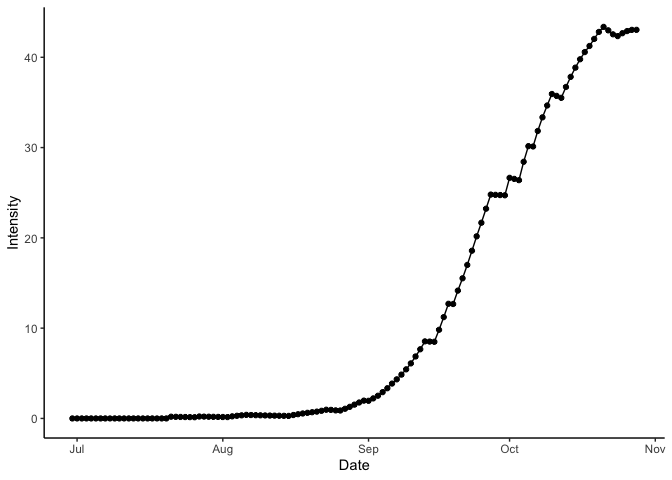

<!-- README.md is generated from README.Rmd. Please edit that file -->

# *epicrop*: Simulation Modelling of Crop Diseases Using a Susceptible-Exposed-Infectious-Removed (SEIR) Model


<!-- badges: start -->

[](https://github.com/adamhsparks/epicrop/actions)
[](https://codecov.io/gh/adamhsparks/epicrop)
[](https://www.repostatus.org/#active)
[](https://lifecycle.r-lib.org/articles/stages.html#experimental)
[](https://zenodo.org/badge/latestdoi/58613738)
<!-- badges: end -->

A fork of [*cropsim*](https://r-forge.r-project.org/R/?group_id=335)
designed to make using the EPIRICE model (Savary *et al.* 2012) for rice
diseases easier to use. This version provides easy to use functions to
fetch weather data from NASA POWER, via the
[*nasapower*](https://cran.r-project.org/package=nasapower) package
(Sparks 2018, Sparks 2020) and predict disease intensity of five rice
diseases using a generic SEIR model (Zadoks 1971) function, `SEIR()`.

The original EPIRICE manuscript, Savary *et al.* (2012), which details
the model and results of its use to model global epidemics of rice
diseases, was published in *Crop Protection* detailing global unmanaged
disease risk of bacterial blight, brown spot, leaf blast, sheath blight
and tungro, which are included in this package.

# Quick start

You can easily simulate any of the five diseases for rice grown anywhere
in the world for years from 1983 to near current using `get_wth()` to
fetch data from the [NASA POWER web API](https://power.larc.nasa.gov).
Alternatively, you can supply your own weather data for any time period
as long as it fits the model’s requirements.

*epicrop* is not yet on CRAN. You can install it this way.

``` r
if (!require("remotes"))
  install.packages("remotes")
remotes::install_github("adamhsparks/epicrop"
)
```

## Get weather data

First you need to provide weather data for the model. *epicrop* provides
the `get_wth()` function to do this. Using it you can fetch weather data
for any place in the world from 1983 to near present by providing the
and latitude and dates or length of rice growing season as shown below.

``` r
library("epicrop")

# Fetch weather for year 2000 wet season for a 120 day rice variety at the IRRI
# Zeigler Experiment Station
wth <- get_wth(
  lonlat = c(121.25562, 14.6774),
  dates = "2000-07-01",
  duration = 120
)

wth
#>        YYYYMMDD DOY  TEMP  RHUM  RAIN      LAT      LON
#>   1: 2000-07-01 183 25.34 91.07 24.87 14.67741 121.2556
#>   2: 2000-07-02 184 25.99 85.71 17.63 14.67741 121.2556
#>   3: 2000-07-03 185 25.35 94.01 33.52 14.67741 121.2556
#>   4: 2000-07-04 186 25.58 93.28 16.21 14.67741 121.2556
#>   5: 2000-07-05 187 25.79 92.62 36.28 14.67741 121.2556
#>  ---                                                   
#> 117: 2000-10-25 299 25.56 89.57 11.04 14.67741 121.2556
#> 118: 2000-10-26 300 25.31 94.35 10.51 14.67741 121.2556
#> 119: 2000-10-27 301 25.58 90.85  9.13 14.67741 121.2556
#> 120: 2000-10-28 302 25.25 92.52 77.16 14.67741 121.2556
#> 121: 2000-10-29 303 24.78 94.41 29.22 14.67741 121.2556
```

## Modelling bacterial blight disease intensity

Once you have the weather data, run the model for any of the five rice
diseases by providing the emergence or crop establishment date for
transplanted rice.

``` r
bb <- predict_bacterial_blight(wth, emergence = "2000-07-01")

bb
#>      simday      dates     sites   latent infectious  removed    senesced
#>   1:      0 2000-07-01  100.0000  0.00000     0.0000   0.0000    0.000000
#>   2:      1 2000-07-02  108.6875  0.00000     0.0000   0.0000    1.000000
#>   3:      2 2000-07-03  118.1002  0.00000     0.0000   0.0000    2.086875
#>   4:      3 2000-07-04  128.2934  0.00000     0.0000   0.0000    3.267877
#>   5:      4 2000-07-05  139.3254  0.00000     0.0000   0.0000    4.550811
#>  ---                                                                     
#> 117:    116 2000-10-25 1308.1960 44.36766   916.5746 362.0380 2210.702871
#> 118:    117 2000-10-26 1256.5107 39.98501   895.0610 405.9148 2267.661678
#> 119:    118 2000-10-27 1211.3863 33.71538   876.5820 446.3983 2320.710228
#> 120:    119 2000-10-28 1165.6534 47.64802   832.9739 490.0064 2376.432231
#> 121:    120 2000-10-29 1120.0107 59.57869   786.7413 536.2390 2434.321334
#>       rateinf rtransfer  rgrowth rsenesced diseased intensity      lat      lon
#>   1:  0.00000   0.00000  9.68750  1.000000    0.000 0.0000000 14.67741 121.2556
#>   2:  0.00000   0.00000 10.49959  1.086875    0.000 0.0000000 14.67741 121.2556
#>   3:  0.00000   0.00000 11.37416  1.181002    0.000 0.0000000 14.67741 121.2556
#>   4:  0.00000   0.00000 12.31499  1.282934    0.000 0.0000000 14.67741 121.2556
#>   5:  0.00000   0.00000 13.32593  1.393254    0.000 0.0000000 14.67741 121.2556
#>  ---                                                                           
#> 117: 17.98063  22.36328 23.25415 56.958808 1322.980 0.4234833 14.67741 121.2556
#> 118: 15.73475  22.00438 23.65885 53.048550 1340.961 0.4266584 14.67741 121.2556
#> 119: 13.93264   0.00000 23.92178 55.722003 1356.696 0.4290448 14.67741 121.2556
#> 120: 11.93067   0.00000 24.17705 57.889104 1370.628 0.4303536 14.67741 121.2556
#> 121:  9.75283   0.00000 24.41029 57.905971 1382.559 0.4304057 14.67741 121.2556
```

Lastly, you can visualise the result of the model run.

``` r
library("ggplot2")

ggplot(data = bb,
       aes(x = dates,
           y = intensity)) +
  labs(y = "Intensity",
       x = "Date") +
  geom_line() +
  geom_point() +
  theme_classic()
```

<div class="figure">


<p class="caption">
Bacterial blight disease progress over time. Results for wet season year
2000 at IRRI Zeigler Experiment Station shown. Weather data used to run
the model were obtained from the NASA Langley Research Center POWER
Project funded through the NASA Earth Science Directorate Applied
Science Program.
</p>

</div>

# Meta

Please note that this project is released with a [Contributor Code of
Conduct](CONDUCT.md). By participating in this project you agree to
abide by its terms.

# References

Serge Savary, Andrew Nelson, Laetitia Willocquet, Ireneo Pangga and
Jorrel Aunario. Modeling and mapping potential epidemics of rice
diseases globally. *Crop Protection*, Volume 34, 2012, Pages 6-17, ISSN
0261-2194 DOI:
[10.1016/j.cropro.2011.11.009](https://doi.org/10.1016/j.cropro.2011.11.009).

Serge Savary, Stacia Stetkiewicz, François Brun, and Laetitia
Willocquet. Modelling and Mapping Potential Epidemics of Wheat
Diseases-Examples on Leaf Rust and Septoria Tritici Blotch Using
EPIWHEAT. *European Journal of Plant Pathology* 142, no. 4 (August 1,
2015): 771–90. DOI:
[10.1007/s10658-015-0650-7](https://doi.org/10.1007/s10658-015-0650-7).

Jan C. Zadoks. Systems Analysis and the Dynamics of Epidemics.
Laboratory of Phytopathology, Agricultural University, Wageningen, The
Netherlands; *Phytopathology* 61:600. DOI:
[10.1094/Phyto-61-600](https://doi.org/10.1094/Phyto-61-600).

Adam Sparks (2018). nasapower: A NASA POWER Global Meteorology, Surface
Solar Energy and Climatology Data Client for R. Journal of Open Source
Software, 3(30), 1035,
[10.21105/joss.01035](https://doi.org/10.21105/joss.01035).

Adam Sparks (2020). *nasapower: NASA-POWER Data from R*. R package
version 3.0.1, URL: <https://CRAN.R-project.org/package=nasapower>.
