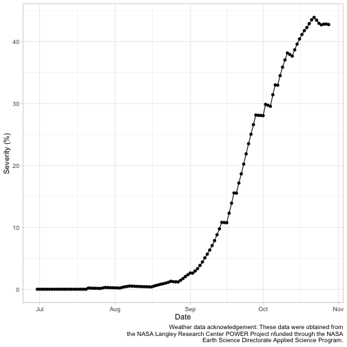
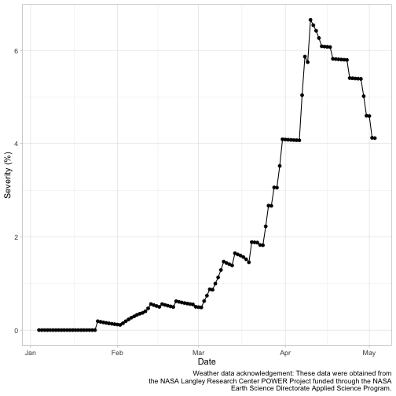

<!-- STOP! Do not edit this file. This file is generated from epicrop.Rmd.orig -->

---
title: "epicrop"
author: "Adam H Sparks"
date: "2021-05-23"
output: rmarkdown::html_vignette
vignette: >
  %\VignetteIndexEntry{epicrop}
  %\VignetteEngine{knitr::rmarkdown}
  %\VignetteEncoding{UTF-8}
  %\VignetteDepends{ggplot2}
  %\VignetteDepends{data.table}
  %\VignetteDepends{tidyr}
  %\VignetteDepends{epifitter}
---


## Introduction to epicrop

_epicrop_ provides an R package of the 'EPIRICE' model as described in Savary *et al.* 2012.
Default values derived from the literature suitable for modelling unmanaged disease severity of five rice diseases, bacterial blight (`predict_bacterial_blight()`); brown spot (`predict_brown_spot()`); leaf blast (`predict_leaf_blast()`); sheath blight (`predict_sheath_blight()`) and tungro (`predict_tungro()`) are provided.
The model uses daily weather data to estimate disease severity.
A function, `get_wth()`, is provided to simplify downloading weather data from the [NASA POWER API](https://power.larc.nasa.gov) that are suitable for use in _epicrop_.

Using the package functions is designed to be straightforward for modelling rice disease risks, but flexible enough to accommodate other pathosystems using the `SEIR()` function.
If you are interested in modelling other pathosystems, please refer to Savary *et al.* 2012 for the development of the parameters that were used for the rice diseases as derived from the existing literature and are implemented in the individual disease model functions.

### Getting started

Load the library.


```r
library("epicrop")
```

### Get weather data

The most simple way to use the model is to download weather data from NASA POWER using `get_wth()`, which provides the data in a format suitable for use in the model and is freely available.
See the help file for `naspower::get_power()` for more details of this functionality and details on the data (Sparks 2018, Sparks 2020).


```r
# Fetch weather for year 2000 season at the IRRI Zeigler Experiment Station
wth <- get_wth(
  lonlat = c(121.25562, 14.6774),
  dates = c("2000-01-01", "2000-12-31")
)

wth
```

```
##        YYYYMMDD DOY  TEMP  RHUM  RAIN   LAT   LON
##   1: 2000-01-01   1 24.25 90.84  9.80 14.68 121.3
##   2: 2000-01-02   2 24.10 90.38  5.01 14.68 121.3
##   3: 2000-01-03   3 23.56 88.12  1.67 14.68 121.3
##   4: 2000-01-04   4 23.41 87.72  0.74 14.68 121.3
##   5: 2000-01-05   5 23.83 87.73  0.35 14.68 121.3
##  ---                                             
## 362: 2000-12-27 362 24.27 92.93 26.32 14.68 121.3
## 363: 2000-12-28 363 24.39 92.33  6.67 14.68 121.3
## 364: 2000-12-29 364 24.39 91.57  7.19 14.68 121.3
## 365: 2000-12-30 365 24.96 87.13  2.97 14.68 121.3
## 366: 2000-12-31 366 24.22 87.21  3.04 14.68 121.3
```

### Predict bacterial blight

All of the `predict_()` family of functions work in exactly the same manner.
You provide them with weather data and an emergence date, that falls within the weather data provided, and they will return a data frame of disease severity over the season and other values associated with the model.
See the help file for `SEIR()` for more on the values returned.


```r
# Predict bacterial blight severity for the year 2000 wet season at IRRI
bb_wet <- predict_bacterial_blight(wth, emergence = "2000-07-01")
```


```r
summary(bb_wet)
```

```
##      simday        dates                sites          latent      
##  Min.   :  0   Min.   :2000-06-30   Min.   : 100   Min.   :  0.00  
##  1st Qu.: 30   1st Qu.:2000-07-30   1st Qu.: 947   1st Qu.:  0.68  
##  Median : 60   Median :2000-08-29   Median :1809   Median : 10.46  
##  Mean   : 60   Mean   :2000-08-29   Mean   :1627   Mean   : 51.79  
##  3rd Qu.: 90   3rd Qu.:2000-09-28   3rd Qu.:2379   3rd Qu.: 87.73  
##  Max.   :120   Max.   :2000-10-28   Max.   :2618   Max.   :217.59  
##    infectious       removed         senesced       rateinf    
##  Min.   :  0.0   Min.   :  0.0   Min.   :   0   Min.   : 0.0  
##  1st Qu.:  1.0   1st Qu.:  0.0   1st Qu.: 116   1st Qu.: 0.0  
##  Median : 19.8   Median :  1.0   Median : 655   Median : 0.0  
##  Mean   :217.3   Mean   : 38.4   Mean   : 823   Mean   :10.8  
##  3rd Qu.:391.6   3rd Qu.: 21.5   3rd Qu.:1436   3rd Qu.:16.7  
##  Max.   :932.3   Max.   :413.0   Max.   :2369   Max.   :62.6  
##    rtransfer       rgrowth        rsenesced        diseased     
##  Min.   : 0.0   Min.   : 9.69   Min.   : 1.00   Min.   :   0.0  
##  1st Qu.: 0.0   1st Qu.:23.41   1st Qu.: 9.47   1st Qu.:   1.7  
##  Median : 0.0   Median :32.66   Median :22.13   Median :  31.6  
##  Mean   :10.1   Mean   :40.45   Mean   :20.03   Mean   : 307.4  
##  3rd Qu.:13.7   3rd Qu.:57.08   3rd Qu.:26.15   3rd Qu.: 629.7  
##  Max.   :62.6   Max.   :79.70   Max.   :59.79   Max.   :1292.1  
##     severity          lat            lon     
##  Min.   : 0.00   Min.   :14.7   Min.   :121  
##  1st Qu.: 0.18   1st Qu.:14.7   1st Qu.:121  
##  Median : 1.21   Median :14.7   Median :121  
##  Mean   :10.26   Mean   :14.7   Mean   :121  
##  3rd Qu.:21.54   3rd Qu.:14.7   3rd Qu.:121  
##  Max.   :40.17   Max.   :14.7   Max.   :121
```

## Plotting using ggplot2

The data are in a wide format by default and need to be converted to long format for use in _ggplot2_ if you wish to plot more than one variable at a time.


```r
library("ggplot2")
library("tidyr")
```

### Wet season sites

The model records the number of sites for each bin daily; this can be graphed as follows.


```r
dat <- pivot_longer(
  bb_wet,
  cols = c("diseased", "removed", "latent", "infectious"),
  names_to = "site",
  values_to = "value"
)

ggplot(data = dat,
       aes(
         x = dates,
         y = value,
         shape = site,
         linetype = site
       )) +
  labs(y = "Sites",
       x = "Date") +
  geom_line(aes(group = site, colour = site)) +
  geom_point(aes(colour = site)) +
  labs(title = "Site states over time for bacterial blight",
       subtitle = "Results for wet season year 2000 at IRRI Zeigler Experiment
       Station shown",
       caption = "Weather data acknowledgement: These data were obtained from
       the NASA Langley Research Center POWER Project funded through the NASA
       Earth Science Directorate Applied Science Program.") +
  theme_light()
```


### Wet season severity

Plotting severity over time does not require any data manipulation.


```r
ggplot(data = bb_wet,
       aes(x = dates,
           y = severity)) +
  labs(y = "Severity (%)",
       x = "Date") +
  geom_line() +
  geom_point() +
  labs(title = "Bacterial blight disease progress over time",
       subtitle = "Results for wet season year 2000 at IRRI Zeigler Experiment
       Station shown",
       caption = "Weather data acknowledgement: These data were obtained from
       the NASA Langley Research Center POWER Project nfunded through the NASA
       Earth Science Directorate Applied Science Program.") +
  theme_light()
```



## Comparing epidemics

The most common way to compare disease epidemics in botanical epidemiology is to use the area under the disease progress curve (AUDPC) (Shaner and Finney 1977).
This is easily calculated from the output of any of the `predict_()` family of functions or a custom `SEIR()` run using the _epifitter_ package (Alves and Del Ponte 2020).

Load _epifitter_ and simulate the disease severity in the dry season starting in January to compare with the initial `bb_wet` results.


```r
library("epifitter")

bb_dry <- predict_bacterial_blight(wth = wth, emergence = "2000-01-05")
summary(bb_dry)
```

```
##      simday        dates                sites          latent     
##  Min.   :  0   Min.   :2000-01-04   Min.   : 100   Min.   : 0.00  
##  1st Qu.: 30   1st Qu.:2000-02-03   1st Qu.: 948   1st Qu.: 0.00  
##  Median : 60   Median :2000-03-04   Median :2525   Median : 1.22  
##  Mean   : 60   Mean   :2000-03-04   Mean   :1911   Mean   : 5.90  
##  3rd Qu.: 90   3rd Qu.:2000-04-03   3rd Qu.:2719   3rd Qu.: 7.49  
##  Max.   :120   Max.   :2000-05-03   Max.   :2778   Max.   :58.00  
##    infectious        removed         senesced       rateinf     
##  Min.   :  0.00   Min.   : 0.00   Min.   :   0   Min.   : 0.00  
##  1st Qu.:  1.00   1st Qu.: 0.00   1st Qu.: 116   1st Qu.: 0.00  
##  Median :  8.62   Median : 1.00   Median : 656   Median : 0.00  
##  Mean   : 30.88   Mean   : 9.68   Mean   : 841   Mean   : 1.18  
##  3rd Qu.: 55.00   3rd Qu.: 9.62   3rd Qu.:1477   3rd Qu.: 0.00  
##  Max.   :112.89   Max.   :64.62   Max.   :2350   Max.   :21.39  
##    rtransfer        rgrowth        rsenesced        diseased    
##  Min.   : 0.00   Min.   : 9.69   Min.   : 1.00   Min.   :  0.0  
##  1st Qu.: 0.00   1st Qu.:29.03   1st Qu.: 9.48   1st Qu.:  1.4  
##  Median : 0.00   Median :34.32   Median :25.25   Median : 14.4  
##  Mean   : 1.18   Mean   :42.41   Mean   :19.73   Mean   : 46.5  
##  3rd Qu.: 0.00   3rd Qu.:57.35   3rd Qu.:27.49   3rd Qu.: 84.8  
##  Max.   :21.39   Max.   :79.65   Max.   :37.74   Max.   :142.8  
##     severity         lat            lon     
##  Min.   :0.00   Min.   :14.7   Min.   :121  
##  1st Qu.:0.19   1st Qu.:14.7   1st Qu.:121  
##  Median :0.53   Median :14.7   Median :121  
##  Mean   :1.35   Mean   :14.7   Mean   :121  
##  3rd Qu.:2.64   3rd Qu.:14.7   3rd Qu.:121  
##  Max.   :4.42   Max.   :14.7   Max.   :121
```

### Dry season severity

Check the disease progress curve for the dry season.


```r
ggplot(data = bb_dry,
       aes(x = dates,
           y = severity)) +
  labs(y = "Severity (%)",
       x = "Date") +
  geom_line() +
  geom_point() +
  labs(title = "Bacterial blight disease progress over time",
       subtitle = "Results for dry season year 2000 at IRRI Zeigler Experiment
       Station shown",
       caption = "Weather data acknowledgement: These data were obtained from
       the NASA Langley Research Center POWER Project funded through the NASA
       Earth Science Directorate Applied Science Program.") +
  theme_light()
```



Calculate the AUDPC using the `AUDPC()` from _epifitter_ for both seasons and compare.


```r
# Dry season
AUDPC(
  time = bb_dry$simday,
  y = bb_dry$severity,
  y_proportion = FALSE,
  type = "relative"
)
```

```
## [1] 0.01346
```

```r
# Wet season
AUDPC(
  time = bb_wet$simday,
  y = bb_wet$severity,
  y_proportion = FALSE,
  type = "relative"
)
```

```
## [1] 0.1017
```

The AUDPC of the wet season is greater than that of the dry season.
Checking the data and referring to the curves, the wet season severity reaches a peak value of 40.17% and the dry season tops out at 4.42%.
So, this meets the expectations that the wet season AUDPC is higher than the dry season, which was predicted to have less disease severity.

# References
Kaique dos S. Alves and Emerson M. Del Ponte (2020). epifitter: Analysis and Simulation of Plant Disease Progress Curves. R package version 0.2.0. URL: <https://CRAN.R-project.org/package=epifitter>.

Serge Savary, Andrew Nelson, Laetitia Willocquet, Ireneo Pangga and Jorrel Aunario. Modeling and mapping potential epidemics of rice diseases globally. *Crop Protection*, Volume 34, 2012, Pages 6-17, ISSN 0261-2194 DOI: [10.1016/j.cropro.2011.11.009](https://doi.org/10.1016/j.cropro.2011.11.009).

Gregory Shaner and R. E. Finney. "The effect of nitrogen fertilization on the expression of slow-mildewing resistance in Knox wheat. *Phytopathology* Volume 67.8, 1977, Pages 1051-1056.

Adam Sparks (2018). nasapower: A NASA POWER Global Meteorology, Surface Solar Energy and Climatology Data
Client for R. Journal of Open Source Software, 3(30), 1035, DOI: [10.21105/joss.01035](https://doi.org/10.21105/joss.01035).

Adam Sparks (2020). _nasapower: NASA-POWER Data from R_. R package version 3.0.1, URL: <https://CRAN.R-project.org/package=nasapower>.
