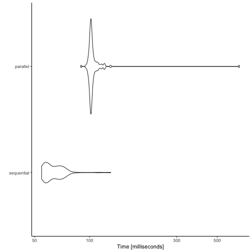

You may wish to compare the effects of different establishment dates, different seasons or different locations on disease levels.
This vignette details how you can automate several runs of _epicrop_ in R and visualise them.
Examples are given that show how to run the process sequentially and in parallel, decreasing the runtime necessary.

## Multiple seasons

### Fetching NASA POWER data for multiple seasons

Start by creating a list of the dates representing the seasons that you want to simulate.
In this case, since we specify the duration of the season, there is no need to explicitly state the end-date, that will automatically be determined by `get_wth()` with the `duration` argument that we pass along in the `purrr::map()`.
You can use as many start dates, representing as many seasons as you desire, but for the purposes of speed in this vignette, only two will be used.


```r
years <- 2000:2001
seasons <- paste0(years, "-06-30")
```

Next use `get_wth()` to fetch the weather data from the [POWER API](https://power.larc.nasa.gov).
In this example we will use the IRRI Zeigler Experiment Station coordinates as shown in the example for `get_wth()`.
With the vector of establishment dates, `seasons`, use `purrr::map()` to fetch all of the seasons with one function.
You could also use R's base `lapply()` here as well if you prefer.


```r
library("epicrop")
library("purrr")

seasons_wth <-
  map(
    .x = seasons,
    .f = get_wth,
    lonlat = c(121.255669, 14.16742),
    duration = 120
  )
```

### Multiple seasons

Now that we have a list of weather data for two seasons we will use `purrr::map_df()` now to run `predict_bacterial_blight()` for two seasons and create a single data frame of the two seasons.
Using `purrr::map()` as above would return a list of two data frames, if you wish.
This behaviour would be the same as if you used R's base `lapply()` here as well.

Add a column to specify the season, in this case we only have wet seasons for two years, but if you have multiple seasons per year, you can still use this template, _e.g._, for multiple seasons in one year, use `lubridate::ymd()`.


```r
library("dplyr")
#> 
#> Attaching package: 'dplyr'
#> The following objects are masked from 'package:stats':
#> 
#>     filter, lag
#> The following objects are masked from 'package:base':
#> 
#>     intersect, setdiff, setequal, union
library("lubridate")
#> 
#> Attaching package: 'lubridate'
#> The following objects are masked from 'package:base':
#> 
#>     date, intersect, setdiff, union
library("epifitter")
library("kableExtra")
#> 
#> Attaching package: 'kableExtra'
#> The following object is masked from 'package:dplyr':
#> 
#>     group_rows

map_df(
  .x = seasons_wth,
  .f = ~ predict_bacterial_blight(emergence = .x$YYYYMMDD[1],
                                  wth = .x)
) %>%
  mutate(season = case_when(year(dates) == 2000 ~ 2000,
                            year(dates) == 2001 ~ 2001)) %>% 
  group_by(season) %>%
  summarise(AUDPC(
    time = simday,
    y = intensity,
    y_proportion = FALSE,
    type = "absolute"
  )) %>%
  rename(AUDPC = 2) %>% 
  kable()
```

<table>
 <thead>
  <tr>
   <th style="text-align:right;"> season </th>
   <th style="text-align:right;"> AUDPC </th>
  </tr>
 </thead>
<tbody>
  <tr>
   <td style="text-align:right;"> 2000 </td>
   <td style="text-align:right;"> 12.82995 </td>
  </tr>
  <tr>
   <td style="text-align:right;"> 2001 </td>
   <td style="text-align:right;"> 7.47565 </td>
  </tr>
</tbody>
</table>

### Multiple seasons using parallel processing

Using _furrr_, we can do the same thing in parallel to reduce the runtime, especially if you have several seasons.

**Note on the use of parallel processing**
> Use parallel processing with caution.
_epicrop_ is highly optimised for speed (as much as pure R can be).
For small runs, _e.g._ one or two seasons or locations, this is will not reduce the time and may increase the run time due to overhead setting up and running the parallel processing.
Best guess is that unless you have > 40 or 50 seasons or locations or some combinations thereof to run the processes in parallel will not be any benefit.

In this case, while this code runs, you can benchmark it and see that this is no faster and in some cases, slower than running the code sequentially.
An example of [benchmarking](Comparing-sequential-versus-parallel-methods) code is provided below.


```r
library("epicrop")
library("furrr")
#> Loading required package: future
library("dplyr")
library("lubridate")
library("epifitter")
library("kableExtra")

# use 2 cores, this will assign one to each year, if you have more years and
# more cores, e.g., an HPC, explore using more resources
plan(multisession, workers = 2)

years <- 2000:2001
seasons <- paste0(years, "-06-30")
seasons_wth <-
  future_map(
    .x = seasons,
    .f = get_wth,
    lonlat = c(121.255669, 14.16742),
    duration = 120,
    .options = furrr_options(seed = NULL)
  )

# run predict_bacterial_blight() over the data frames of weather
future_map_dfr(
  .x = seasons_wth,
  .f = ~ predict_bacterial_blight(emergence = .x$YYYYMMDD[1],
                                  wth = .x),
  .options = furrr_options(seed = NULL)
) %>%
  mutate(season = case_when(year(dates) == 2000 ~ 2000,
                            year(dates) == 2001 ~ 2001)) %>% 
  group_by(season) %>%
  summarise(AUDPC(
    time = simday,
    y = intensity,
    y_proportion = FALSE,
    type = "absolute"
  )) %>%
  rename(AUDPC = 2) %>% 
  kable()
```

<table>
 <thead>
  <tr>
   <th style="text-align:right;"> season </th>
   <th style="text-align:right;"> AUDPC </th>
  </tr>
 </thead>
<tbody>
  <tr>
   <td style="text-align:right;"> 2000 </td>
   <td style="text-align:right;"> 12.82995 </td>
  </tr>
  <tr>
   <td style="text-align:right;"> 2001 </td>
   <td style="text-align:right;"> 7.47565 </td>
  </tr>
</tbody>
</table>

## Multiple establishment dates

To simulate multiple establishment dates and across multiple years at the same time we can use `purrr::cross2()` to create a vector of all year and month-day combinations that we wish to simulate.

Simplifying the weather data, we will only use the first date of each year and fetch weather data using the `duration` option, specifying 180 days.
This gives six months of data and extends to the end and a bit beyond the last growing season of the final establishment date, "01-31".
`predict_bacterial_blight()` will take the full six months of weather data and subset for the respective growing seasons, selecting only the necessary weather data.

Using `purrr::map2` allows for using two variables, one for weather data, `wth`, and one for the emergence/establishment dates, `emergence_dates`.
This returns a list of data, but using `dplyr::bind_rows(.id = "emergence")` creates a data frame with a column of emergence/establishment dates that can be used for grouping the data for further analysis or visualisation.


```r
library("epicrop")
library("purrr")
library("dplyr")
library("lubridate")
library("epifitter")
library("kableExtra")

years <- 2001:2020
month_day <- c("-06-01", "-06-14", "-06-30")
emergence_dates <-
  cross2(years, month_day) %>%
  map_chr(paste0, collapse = "") %>%
  sort() %>%
  as_date()

# create a vector of dates for weather data.
# Only take the earliest establishment date, then extend the duration out past
# 120 days from final establishment date.
# Here just taking 180 days, 6 months, works well.
wth_start_dates <- paste0(years, month_day[1])

seasons_wth <- map_dfr(
  .x = wth_start_dates,
  .f = get_wth,
    lonlat = c(121.255669, 14.16742),
  duration = 180
) %>%
  mutate(YYYYMMDD = as_date(YYYYMMDD))

# Once we have all the weather, create a list of weather data.frames for each
# establishment date
# Create time intervals to subset the weather data, creating a list new
# data.frames for each establishment date.

wth <-
  map(.x = emergence_dates,
      .f = ~ subset(seasons_wth, YYYYMMDD >= .x &
                      YYYYMMDD <= .x + 120))

names(wth) <- emergence_dates

map2(
  .x = wth,
  .y = emergence_dates,
  .f = ~ predict_bacterial_blight(emergence = .y,
                                  wth = .x)
) %>%
  bind_rows(.id = "emergence") %>% 
  group_by(emergence) %>%
  summarise(AUDPC(
    time = simday,
    y = intensity,
    y_proportion = FALSE,
    type = "absolute"
  )) %>%
  rename(AUDPC = 2) %>% 
  kable()
```

<table>
 <thead>
  <tr>
   <th style="text-align:left;"> emergence </th>
   <th style="text-align:right;"> AUDPC </th>
  </tr>
 </thead>
<tbody>
  <tr>
   <td style="text-align:left;"> 2001-06-01 </td>
   <td style="text-align:right;"> 15.277910 </td>
  </tr>
  <tr>
   <td style="text-align:left;"> 2001-06-14 </td>
   <td style="text-align:right;"> 9.695948 </td>
  </tr>
  <tr>
   <td style="text-align:left;"> 2001-06-30 </td>
   <td style="text-align:right;"> 7.475650 </td>
  </tr>
  <tr>
   <td style="text-align:left;"> 2002-06-01 </td>
   <td style="text-align:right;"> 15.877835 </td>
  </tr>
  <tr>
   <td style="text-align:left;"> 2002-06-14 </td>
   <td style="text-align:right;"> 14.362855 </td>
  </tr>
  <tr>
   <td style="text-align:left;"> 2002-06-30 </td>
   <td style="text-align:right;"> 14.676760 </td>
  </tr>
  <tr>
   <td style="text-align:left;"> 2003-06-01 </td>
   <td style="text-align:right;"> 12.640228 </td>
  </tr>
  <tr>
   <td style="text-align:left;"> 2003-06-14 </td>
   <td style="text-align:right;"> 12.580026 </td>
  </tr>
  <tr>
   <td style="text-align:left;"> 2003-06-30 </td>
   <td style="text-align:right;"> 17.212159 </td>
  </tr>
  <tr>
   <td style="text-align:left;"> 2004-06-01 </td>
   <td style="text-align:right;"> 12.155299 </td>
  </tr>
  <tr>
   <td style="text-align:left;"> 2004-06-14 </td>
   <td style="text-align:right;"> 14.998404 </td>
  </tr>
  <tr>
   <td style="text-align:left;"> 2004-06-30 </td>
   <td style="text-align:right;"> 11.690150 </td>
  </tr>
  <tr>
   <td style="text-align:left;"> 2005-06-01 </td>
   <td style="text-align:right;"> 16.354935 </td>
  </tr>
  <tr>
   <td style="text-align:left;"> 2005-06-14 </td>
   <td style="text-align:right;"> 15.370241 </td>
  </tr>
  <tr>
   <td style="text-align:left;"> 2005-06-30 </td>
   <td style="text-align:right;"> 16.209512 </td>
  </tr>
  <tr>
   <td style="text-align:left;"> 2006-06-01 </td>
   <td style="text-align:right;"> 16.590759 </td>
  </tr>
  <tr>
   <td style="text-align:left;"> 2006-06-14 </td>
   <td style="text-align:right;"> 16.182310 </td>
  </tr>
  <tr>
   <td style="text-align:left;"> 2006-06-30 </td>
   <td style="text-align:right;"> 15.106937 </td>
  </tr>
  <tr>
   <td style="text-align:left;"> 2007-06-01 </td>
   <td style="text-align:right;"> 10.255052 </td>
  </tr>
  <tr>
   <td style="text-align:left;"> 2007-06-14 </td>
   <td style="text-align:right;"> 8.940507 </td>
  </tr>
  <tr>
   <td style="text-align:left;"> 2007-06-30 </td>
   <td style="text-align:right;"> 14.232105 </td>
  </tr>
  <tr>
   <td style="text-align:left;"> 2008-06-01 </td>
   <td style="text-align:right;"> 11.179617 </td>
  </tr>
  <tr>
   <td style="text-align:left;"> 2008-06-14 </td>
   <td style="text-align:right;"> 11.019640 </td>
  </tr>
  <tr>
   <td style="text-align:left;"> 2008-06-30 </td>
   <td style="text-align:right;"> 12.945964 </td>
  </tr>
  <tr>
   <td style="text-align:left;"> 2009-06-01 </td>
   <td style="text-align:right;"> 9.119311 </td>
  </tr>
  <tr>
   <td style="text-align:left;"> 2009-06-14 </td>
   <td style="text-align:right;"> 14.738053 </td>
  </tr>
  <tr>
   <td style="text-align:left;"> 2009-06-30 </td>
   <td style="text-align:right;"> 12.373179 </td>
  </tr>
  <tr>
   <td style="text-align:left;"> 2010-06-01 </td>
   <td style="text-align:right;"> 16.618239 </td>
  </tr>
  <tr>
   <td style="text-align:left;"> 2010-06-14 </td>
   <td style="text-align:right;"> 18.074185 </td>
  </tr>
  <tr>
   <td style="text-align:left;"> 2010-06-30 </td>
   <td style="text-align:right;"> 18.040606 </td>
  </tr>
  <tr>
   <td style="text-align:left;"> 2011-06-01 </td>
   <td style="text-align:right;"> 14.473648 </td>
  </tr>
  <tr>
   <td style="text-align:left;"> 2011-06-14 </td>
   <td style="text-align:right;"> 14.852925 </td>
  </tr>
  <tr>
   <td style="text-align:left;"> 2011-06-30 </td>
   <td style="text-align:right;"> 18.994388 </td>
  </tr>
  <tr>
   <td style="text-align:left;"> 2012-06-01 </td>
   <td style="text-align:right;"> 18.359043 </td>
  </tr>
  <tr>
   <td style="text-align:left;"> 2012-06-14 </td>
   <td style="text-align:right;"> 18.946737 </td>
  </tr>
  <tr>
   <td style="text-align:left;"> 2012-06-30 </td>
   <td style="text-align:right;"> 19.416862 </td>
  </tr>
  <tr>
   <td style="text-align:left;"> 2013-06-01 </td>
   <td style="text-align:right;"> 18.577424 </td>
  </tr>
  <tr>
   <td style="text-align:left;"> 2013-06-14 </td>
   <td style="text-align:right;"> 20.078029 </td>
  </tr>
  <tr>
   <td style="text-align:left;"> 2013-06-30 </td>
   <td style="text-align:right;"> 20.589782 </td>
  </tr>
  <tr>
   <td style="text-align:left;"> 2014-06-01 </td>
   <td style="text-align:right;"> 11.994548 </td>
  </tr>
  <tr>
   <td style="text-align:left;"> 2014-06-14 </td>
   <td style="text-align:right;"> 12.067435 </td>
  </tr>
  <tr>
   <td style="text-align:left;"> 2014-06-30 </td>
   <td style="text-align:right;"> 12.077268 </td>
  </tr>
  <tr>
   <td style="text-align:left;"> 2015-06-01 </td>
   <td style="text-align:right;"> 9.420439 </td>
  </tr>
  <tr>
   <td style="text-align:left;"> 2015-06-14 </td>
   <td style="text-align:right;"> 10.240231 </td>
  </tr>
  <tr>
   <td style="text-align:left;"> 2015-06-30 </td>
   <td style="text-align:right;"> 15.422554 </td>
  </tr>
  <tr>
   <td style="text-align:left;"> 2016-06-01 </td>
   <td style="text-align:right;"> 14.496149 </td>
  </tr>
  <tr>
   <td style="text-align:left;"> 2016-06-14 </td>
   <td style="text-align:right;"> 12.224932 </td>
  </tr>
  <tr>
   <td style="text-align:left;"> 2016-06-30 </td>
   <td style="text-align:right;"> 14.783339 </td>
  </tr>
  <tr>
   <td style="text-align:left;"> 2017-06-01 </td>
   <td style="text-align:right;"> 18.328406 </td>
  </tr>
  <tr>
   <td style="text-align:left;"> 2017-06-14 </td>
   <td style="text-align:right;"> 15.450603 </td>
  </tr>
  <tr>
   <td style="text-align:left;"> 2017-06-30 </td>
   <td style="text-align:right;"> 13.155242 </td>
  </tr>
  <tr>
   <td style="text-align:left;"> 2018-06-01 </td>
   <td style="text-align:right;"> 15.173660 </td>
  </tr>
  <tr>
   <td style="text-align:left;"> 2018-06-14 </td>
   <td style="text-align:right;"> 19.616036 </td>
  </tr>
  <tr>
   <td style="text-align:left;"> 2018-06-30 </td>
   <td style="text-align:right;"> 15.789342 </td>
  </tr>
  <tr>
   <td style="text-align:left;"> 2019-06-01 </td>
   <td style="text-align:right;"> 12.952631 </td>
  </tr>
  <tr>
   <td style="text-align:left;"> 2019-06-14 </td>
   <td style="text-align:right;"> 14.426301 </td>
  </tr>
  <tr>
   <td style="text-align:left;"> 2019-06-30 </td>
   <td style="text-align:right;"> 14.490195 </td>
  </tr>
  <tr>
   <td style="text-align:left;"> 2020-06-01 </td>
   <td style="text-align:right;"> 9.688796 </td>
  </tr>
  <tr>
   <td style="text-align:left;"> 2020-06-14 </td>
   <td style="text-align:right;"> 9.103196 </td>
  </tr>
  <tr>
   <td style="text-align:left;"> 2020-06-30 </td>
   <td style="text-align:right;"> 13.130675 </td>
  </tr>
</tbody>
</table>

### Multiple establishment dates using parallel processing

To run the previous example in parallel, substitute _furrr_ equivalent functions for the _purrr_ functions used above.
These are easily identified by the `future_` prefix on each of the functions where they are used.


```r
library("furrr")
library("purrr")
library("dplyr")
library("ggplot2")
library("lubridate")
library("epicrop")
library("epifitter")
library("kableExtra")

plan(multisession, workers = 4)

years <- 2001:2020
month_day <- c("-06-01", "-06-14", "-06-30")
emergence_dates <-
  cross2(years, month_day) %>%
  map_chr(paste0, collapse = "") %>%
  sort() %>%
  as_date()

# create a vector of dates for weather data.
# Only take the earliest establishment date, then extend the duration out past
# 120 days from final establishment date.
# Here just taking 180 days, 6 months, works well.
wth_start_dates <- paste0(years, month_day[1])

seasons_wth <-
  future_map_dfr(
    .x = wth_start_dates,
    .f = get_wth,
    lonlat = c(121.255669, 14.16742),
    duration = 180,
    .options = furrr_options(seed = NULL)
  ) %>%
  mutate(YYYYMMDD = as_date(YYYYMMDD))

# Once we have all the weather, create a list of weather data.frames for each
# establishment date
# Create time intervals to subset the weather data, creating a list new
# data.frames for each establishment date.

wth <-
  future_map(.x = emergence_dates,
             .f = ~ subset(seasons_wth, YYYYMMDD >= .x &
                             YYYYMMDD <= .x + 120))

names(wth) <- emergence_dates

future_map2(
  .x = wth,
  .y = emergence_dates,
  .f = ~ predict_bacterial_blight(emergence = .y,
                            wth = .x),
  .options = furrr_options(seed = NULL)
) %>%
  bind_rows(.id = "emergence") %>%
  group_by(emergence) %>%
  summarise(AUDPC(
    time = simday,
    y = intensity,
    y_proportion = FALSE,
    type = "absolute"
  )) %>%
  rename(AUDPC = 2) %>% 
  kable()
```

<table>
 <thead>
  <tr>
   <th style="text-align:left;"> emergence </th>
   <th style="text-align:right;"> AUDPC </th>
  </tr>
 </thead>
<tbody>
  <tr>
   <td style="text-align:left;"> 2001-06-01 </td>
   <td style="text-align:right;"> 15.277910 </td>
  </tr>
  <tr>
   <td style="text-align:left;"> 2001-06-14 </td>
   <td style="text-align:right;"> 9.695948 </td>
  </tr>
  <tr>
   <td style="text-align:left;"> 2001-06-30 </td>
   <td style="text-align:right;"> 7.475650 </td>
  </tr>
  <tr>
   <td style="text-align:left;"> 2002-06-01 </td>
   <td style="text-align:right;"> 15.877835 </td>
  </tr>
  <tr>
   <td style="text-align:left;"> 2002-06-14 </td>
   <td style="text-align:right;"> 14.362855 </td>
  </tr>
  <tr>
   <td style="text-align:left;"> 2002-06-30 </td>
   <td style="text-align:right;"> 14.676760 </td>
  </tr>
  <tr>
   <td style="text-align:left;"> 2003-06-01 </td>
   <td style="text-align:right;"> 12.640228 </td>
  </tr>
  <tr>
   <td style="text-align:left;"> 2003-06-14 </td>
   <td style="text-align:right;"> 12.580026 </td>
  </tr>
  <tr>
   <td style="text-align:left;"> 2003-06-30 </td>
   <td style="text-align:right;"> 17.212159 </td>
  </tr>
  <tr>
   <td style="text-align:left;"> 2004-06-01 </td>
   <td style="text-align:right;"> 12.155299 </td>
  </tr>
  <tr>
   <td style="text-align:left;"> 2004-06-14 </td>
   <td style="text-align:right;"> 14.998404 </td>
  </tr>
  <tr>
   <td style="text-align:left;"> 2004-06-30 </td>
   <td style="text-align:right;"> 11.690150 </td>
  </tr>
  <tr>
   <td style="text-align:left;"> 2005-06-01 </td>
   <td style="text-align:right;"> 16.354935 </td>
  </tr>
  <tr>
   <td style="text-align:left;"> 2005-06-14 </td>
   <td style="text-align:right;"> 15.370241 </td>
  </tr>
  <tr>
   <td style="text-align:left;"> 2005-06-30 </td>
   <td style="text-align:right;"> 16.209512 </td>
  </tr>
  <tr>
   <td style="text-align:left;"> 2006-06-01 </td>
   <td style="text-align:right;"> 16.590759 </td>
  </tr>
  <tr>
   <td style="text-align:left;"> 2006-06-14 </td>
   <td style="text-align:right;"> 16.182310 </td>
  </tr>
  <tr>
   <td style="text-align:left;"> 2006-06-30 </td>
   <td style="text-align:right;"> 15.106937 </td>
  </tr>
  <tr>
   <td style="text-align:left;"> 2007-06-01 </td>
   <td style="text-align:right;"> 10.255052 </td>
  </tr>
  <tr>
   <td style="text-align:left;"> 2007-06-14 </td>
   <td style="text-align:right;"> 8.940507 </td>
  </tr>
  <tr>
   <td style="text-align:left;"> 2007-06-30 </td>
   <td style="text-align:right;"> 14.232105 </td>
  </tr>
  <tr>
   <td style="text-align:left;"> 2008-06-01 </td>
   <td style="text-align:right;"> 11.179617 </td>
  </tr>
  <tr>
   <td style="text-align:left;"> 2008-06-14 </td>
   <td style="text-align:right;"> 11.019640 </td>
  </tr>
  <tr>
   <td style="text-align:left;"> 2008-06-30 </td>
   <td style="text-align:right;"> 12.945964 </td>
  </tr>
  <tr>
   <td style="text-align:left;"> 2009-06-01 </td>
   <td style="text-align:right;"> 9.119311 </td>
  </tr>
  <tr>
   <td style="text-align:left;"> 2009-06-14 </td>
   <td style="text-align:right;"> 14.738053 </td>
  </tr>
  <tr>
   <td style="text-align:left;"> 2009-06-30 </td>
   <td style="text-align:right;"> 12.373179 </td>
  </tr>
  <tr>
   <td style="text-align:left;"> 2010-06-01 </td>
   <td style="text-align:right;"> 16.618239 </td>
  </tr>
  <tr>
   <td style="text-align:left;"> 2010-06-14 </td>
   <td style="text-align:right;"> 18.074185 </td>
  </tr>
  <tr>
   <td style="text-align:left;"> 2010-06-30 </td>
   <td style="text-align:right;"> 18.040606 </td>
  </tr>
  <tr>
   <td style="text-align:left;"> 2011-06-01 </td>
   <td style="text-align:right;"> 14.473648 </td>
  </tr>
  <tr>
   <td style="text-align:left;"> 2011-06-14 </td>
   <td style="text-align:right;"> 14.852925 </td>
  </tr>
  <tr>
   <td style="text-align:left;"> 2011-06-30 </td>
   <td style="text-align:right;"> 18.994388 </td>
  </tr>
  <tr>
   <td style="text-align:left;"> 2012-06-01 </td>
   <td style="text-align:right;"> 18.359043 </td>
  </tr>
  <tr>
   <td style="text-align:left;"> 2012-06-14 </td>
   <td style="text-align:right;"> 18.946737 </td>
  </tr>
  <tr>
   <td style="text-align:left;"> 2012-06-30 </td>
   <td style="text-align:right;"> 19.416862 </td>
  </tr>
  <tr>
   <td style="text-align:left;"> 2013-06-01 </td>
   <td style="text-align:right;"> 18.577424 </td>
  </tr>
  <tr>
   <td style="text-align:left;"> 2013-06-14 </td>
   <td style="text-align:right;"> 20.078029 </td>
  </tr>
  <tr>
   <td style="text-align:left;"> 2013-06-30 </td>
   <td style="text-align:right;"> 20.589782 </td>
  </tr>
  <tr>
   <td style="text-align:left;"> 2014-06-01 </td>
   <td style="text-align:right;"> 11.994548 </td>
  </tr>
  <tr>
   <td style="text-align:left;"> 2014-06-14 </td>
   <td style="text-align:right;"> 12.067435 </td>
  </tr>
  <tr>
   <td style="text-align:left;"> 2014-06-30 </td>
   <td style="text-align:right;"> 12.077268 </td>
  </tr>
  <tr>
   <td style="text-align:left;"> 2015-06-01 </td>
   <td style="text-align:right;"> 9.420439 </td>
  </tr>
  <tr>
   <td style="text-align:left;"> 2015-06-14 </td>
   <td style="text-align:right;"> 10.240231 </td>
  </tr>
  <tr>
   <td style="text-align:left;"> 2015-06-30 </td>
   <td style="text-align:right;"> 15.422554 </td>
  </tr>
  <tr>
   <td style="text-align:left;"> 2016-06-01 </td>
   <td style="text-align:right;"> 14.496149 </td>
  </tr>
  <tr>
   <td style="text-align:left;"> 2016-06-14 </td>
   <td style="text-align:right;"> 12.224932 </td>
  </tr>
  <tr>
   <td style="text-align:left;"> 2016-06-30 </td>
   <td style="text-align:right;"> 14.783339 </td>
  </tr>
  <tr>
   <td style="text-align:left;"> 2017-06-01 </td>
   <td style="text-align:right;"> 18.328406 </td>
  </tr>
  <tr>
   <td style="text-align:left;"> 2017-06-14 </td>
   <td style="text-align:right;"> 15.450603 </td>
  </tr>
  <tr>
   <td style="text-align:left;"> 2017-06-30 </td>
   <td style="text-align:right;"> 13.155242 </td>
  </tr>
  <tr>
   <td style="text-align:left;"> 2018-06-01 </td>
   <td style="text-align:right;"> 15.173660 </td>
  </tr>
  <tr>
   <td style="text-align:left;"> 2018-06-14 </td>
   <td style="text-align:right;"> 19.616036 </td>
  </tr>
  <tr>
   <td style="text-align:left;"> 2018-06-30 </td>
   <td style="text-align:right;"> 15.789342 </td>
  </tr>
  <tr>
   <td style="text-align:left;"> 2019-06-01 </td>
   <td style="text-align:right;"> 12.952631 </td>
  </tr>
  <tr>
   <td style="text-align:left;"> 2019-06-14 </td>
   <td style="text-align:right;"> 14.426301 </td>
  </tr>
  <tr>
   <td style="text-align:left;"> 2019-06-30 </td>
   <td style="text-align:right;"> 14.490195 </td>
  </tr>
  <tr>
   <td style="text-align:left;"> 2020-06-01 </td>
   <td style="text-align:right;"> 9.688796 </td>
  </tr>
  <tr>
   <td style="text-align:left;"> 2020-06-14 </td>
   <td style="text-align:right;"> 9.103196 </td>
  </tr>
  <tr>
   <td style="text-align:left;"> 2020-06-30 </td>
   <td style="text-align:right;"> 13.130675 </td>
  </tr>
</tbody>
</table>

## Comparing sequential versus parallel methods

It is possible to measure the effect of running the simulations in parallel as compared to sequentially using the _microbenchmark_ package.
Using the second examples of multiple establishment dates with the data from those examples.


```r
library("microbenchmark")
plan(multisession, workers = 2)

mbm <- microbenchmark(
  sequential = map2(
    .x = wth,
    .y = emergence_dates,
    .f = ~ predict_bacterial_blight(emergence = .y,
                                    wth = .x)
  ) %>%
    bind_rows(.id = "emergence"),
  parallel = future_map2(
    .x = wth,
    .y = emergence_dates,
    .f = ~ predict_bacterial_blight(emergence = .y,
                              wth = .x),
    .options = furrr_options(seed = NULL)
  ) %>% 
    bind_rows(.id = "emergence"),
  unit = "relative"
)

mbm
#> Unit: relative
#>        expr      min       lq     mean   median       uq     max neval
#>  sequential 1.631908 1.611902 1.566627 1.564127 1.541005 1.02754   100
#>    parallel 1.000000 1.000000 1.000000 1.000000 1.000000 1.00000   100

autoplot(mbm)
```




## Multiple locations


