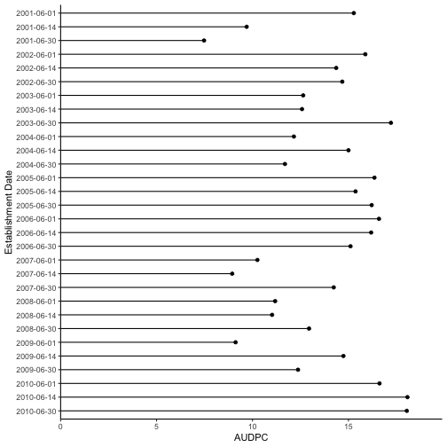
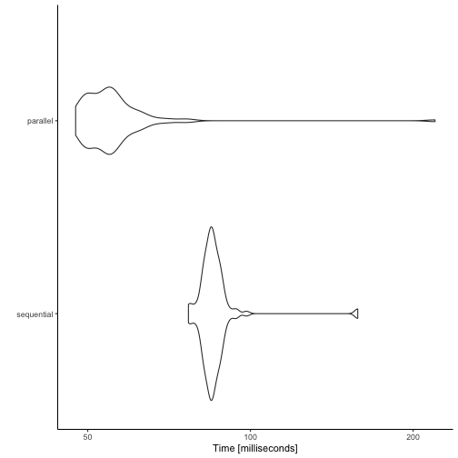

<!-- STOP! Do not edit this file. This file is generated from multiples.Rmd.orig -->


You may wish to compare the effects of different establishment dates, different seasons or different locations on disease levels.
This vignette details how you can automate several runs of _epicrop_ in R and visualise them.
Examples are given that show how to run the process sequentially and in parallel, decreasing the runtime necessary and how to benchmark your processes to help optimise your workflow.

## Multiple seasons

### Fetching NASA POWER data for multiple seasons

Start by creating a list of the dates representing the seasons that you want to simulate.
In this case, since we specify the duration of the season, there is no need to explicitly state the end-date, that will automatically be determined by `get_wth()` with the `duration` argument that we pass along in the `purrr::map()`.
You can use as many start dates, representing as many seasons as you desire, but for the purposes of speed in this vignette, only two will be used.


```r
years <- 2000:2001
seasons <- paste0(years, "-06-30")
```

Next use `get_wth()` to fetch the weather data from the [POWER API](https://power.larc.nasa.gov).
In this example we will use the IRRI Zeigler Experiment Station coordinates as shown in the example for `get_wth()`.
With the vector of establishment dates, `seasons`, use `purrr::map()` to fetch all of the seasons with one function.
You could also use R's base `lapply()` here as well if you prefer.


```r
library("epicrop")
library("purrr")

seasons_wth <-
  map(
    .x = seasons,
    .f = get_wth,
    lonlat = c(121.255669, 14.16742),
    duration = 120
  )
#> Error: Something went wrong with the query, no data were returned. Please see <https://power.larc.nasa.gov> for potential server issues.
```

### Using _purrr_ to simplify the simulation of multiple seasons

Now that we have a list of weather data for two seasons we will use `purrr::map_df()` now to run `predict_bacterial_blight()` for two seasons and create a single data frame of the two seasons.
Using `purrr::map()` as above would return a list of two data frames, if you wish.
This behaviour would be the same as if you used R's base `lapply()` here as well.

Add a column to specify the season, in this case we only have wet seasons for two years, but if you have multiple seasons per year, you can still use this template, _e.g._, for multiple seasons in one year, use `lubridate::ymd()`.


```r
library("dplyr")
library("lubridate")
library("pander")

seasons <- map_df(
  .x = seasons_wth,
  .f = ~ predict_bacterial_blight(emergence = .x$YYYYMMDD[1],
                                  wth = .x)
) %>%
  mutate(season = case_when(year(dates) == 2000 ~ 2000,
                            year(dates) == 2001 ~ 2001)) %>%
  group_by(season) %>%
  relocate(season, AUDPC) %>%
  distinct(AUDPC, season)
#> Error in .x$YYYYMMDD: $ operator is invalid for atomic vectors

pander(seasons)
```

_2000-06-30_ and _2001-06-30_

### Visualising differences in AUDPC between seasons

A simple bar chart created using _ggplot2_ is an effective way to visualise the difference between the two seasons.


```r
library("ggplot2")
ggplot(seasons,
       aes(y = as.factor(season),
           x = AUDPC)) +
  geom_col(width = 0.5,
           orientation = "y") +
  ylab("Season") +
  theme_classic()
#> Error: `data` must be a data frame, or other object coercible by `fortify()`, not a character vector.
```

### Simulating multiple seasons with _furrr_ using parallel processing

Using _furrr_, we can do the same thing in parallel to reduce the runtime, especially if you have several seasons.

#### A note on the use of parallel processing

Use parallel processing with caution.
_epicrop_ is highly optimised for speed (as much as pure R can be).
For small runs, _e.g._ one or two seasons or locations, this is will not reduce the time and may increase the run time due to overhead setting up and running the parallel processing.
Best guess is that unless you have > 40 or 50 seasons or locations or some combinations thereof; to run the processes in parallel will not be any benefit.

In this case, while this code runs, you can benchmark it and see that this is no faster and in some cases, slower than running the code sequentially.
An example benchmarking different methods is provided here.


```r
library("epicrop")
library("furrr")
library("dplyr")
library("lubridate")
library("pander")

# Respect the API server and use 1 core
plan(multisession, workers = 1)

years <- 2000:2001
seasons <- paste0(years, "-06-30")
seasons_wth <-
  future_map(
    .x = seasons,
    .f = get_wth,
    lonlat = c(121.255669, 14.16742),
    duration = 120,
    .options = furrr_options(seed = NULL)
  )
#> Error: Something went wrong with the query, no data were returned. Please see <https://power.larc.nasa.gov> for potential server issues.

# for local processing use 2 cores, this will assign one to each year, if you
# have more years and more cores, e.g., an HPC, explore using more resources

plan(multisession, workers = 2)

# run predict_bacterial_blight() over the data frames of weather
future_map_dfr(
  .x = seasons_wth,
  .f = ~ predict_bacterial_blight(emergence = .x$YYYYMMDD[1],
                                  wth = .x),
  .options = furrr_options(seed = NULL)
) %>%
  mutate(season = case_when(year(dates) == 2000 ~ 2000,
                            year(dates) == 2001 ~ 2001)) %>%
  group_by(season) %>%
  relocate(season, AUDPC) %>%
  distinct(AUDPC, season) %>%
  pander()
#> Error in .x$YYYYMMDD: $ operator is invalid for atomic vectors
#> Error in if (tail(stdout, 1) == "") {: argument is of length zero
```

We can see here that the AUDPC values match using both processing methods.

## Multiple establishment dates

### Using _purrr_ to simulate multiple establishment dates

To simulate multiple establishment dates and across multiple years at the same time we can use `purrr::cross2()` to create a vector of all year and month-day combinations that we wish to simulate.

Simplifying the weather data, we will only use the first date of each year and fetch weather data using the `duration` option, specifying 180 days.
This gives six months of data and extends to the end and a bit beyond the last growing season of the final establishment date, "01-31".
`predict_bacterial_blight()` will take the full six months of weather data and subset for the respective growing seasons, selecting only the necessary weather data.

Using `purrr::map2` allows for using two variables, one for weather data, `wth`, and one for the emergence/establishment dates, `emergence_dates`.
This returns a list of data, but using `dplyr::bind_rows(.id = "emergence")` creates a data frame with a column of emergence/establishment dates that can be used for grouping the data for further analysis or visualisation.


```r
library("epicrop")
library("purrr")
library("dplyr")
library("lubridate")
library("pander")
library("furrr")

years <- 2001:2010
month_day <- c("-06-01", "-06-14", "-06-30")
emergence_dates <-
  cross2(years, month_day) %>%
  map_chr(paste0, collapse = "") %>%
  sort() %>%
  as_date()

# Respect the API server and use 1 core
plan(multisession, workers = 1)

# create a vector of dates for weather data.
# Only take the earliest establishment date, then extend the duration out past
# 120 days from final establishment date.
# Here just taking 180 days, 6 months, works well.
wth_start_dates <- paste0(years, month_day[1])

seasons_wth <- map_dfr(
  .x = wth_start_dates,
  .f = get_wth,
  lonlat = c(121.255669, 14.16742),
  duration = 180
) %>%
  mutate(YYYYMMDD = as_date(YYYYMMDD))
#> Error: Something went wrong with the query, no data were returned. Please see <https://power.larc.nasa.gov> for potential server issues.

# Now use 4 cores for the local processing
plan(multisession, workers = 4)

# Once we have all the weather, create a list of weather data.frames for each
# establishment date
# Create time intervals to subset the weather data, creating a list new
# data.frames for each establishment date.

wth <-
  map(.x = emergence_dates,
      .f = ~ subset(seasons_wth, YYYYMMDD >= .x &
                      YYYYMMDD <= .x + 120)) %>%
  setNames(emergence_dates)

multi_dates <- map2(
  .x = wth,
  .y = emergence_dates,
  .f = ~ predict_bacterial_blight(emergence = .y,
                                  wth = .x)
) %>%
  bind_rows(.id = "emergence") %>%
  group_by(emergence) %>%
  relocate(emergence, AUDPC) %>%
  distinct(AUDPC, emergence)

pander(multi_dates)
```


--------------------
 emergence    AUDPC 
------------ -------
 2001-06-01   11.75 

 2001-06-14   6.976 

 2001-06-30   5.94  

 2002-06-01   12.47 

 2002-06-14   10.45 

 2002-06-30   12.19 

 2003-06-01   10.18 

 2003-06-14   10.58 

 2003-06-30   15.26 

 2004-06-01   10.3  

 2004-06-14   13.29 

 2004-06-30   10.19 

 2005-06-01   14.29 

 2005-06-14   13.86 

 2005-06-30   15.1  

 2006-06-01   15.06 

 2006-06-14   14.01 

 2006-06-30   12.62 

 2007-06-01   7.811 

 2007-06-14   7.173 

 2007-06-30   10.91 

 2008-06-01   9.31  

 2008-06-14   8.957 

 2008-06-30   10.27 

 2009-06-01   4.83  

 2009-06-14   9.118 

 2009-06-30   6.797 

 2010-06-01   13.95 

 2010-06-14   16.31 

 2010-06-30    16   
--------------------

That's a bit long and there's lots of values to digest here.

### Visualising multiple establishment dates using a stem plot

A bar chart as with the previous example works, but it can be simplified and made more clear using a stem plot created with _ggplot2_.
Using `ggplot2::geom_segment()` and `ggplot2::geom_point()` we can maximise the ink to information ratio and create an easy to view and interpret graph of these data.

Note the additional `ggplot2::aes()` parameters here, `xend` and `yend` are necessary since we're using `ggplot2::geom_segment()`.


```r
library("ggplot2")
ggplot(data = multi_dates,
       aes(
         x = AUDPC,
         xend = 0,
         y = as.factor(emergence),
         yend = as.factor(emergence)
       )) +
  geom_segment() +
  geom_point() +
  scale_x_continuous(expand = expansion(mult = c(0, 0.1))) +
  scale_y_discrete(limits = rev) +
  ylab("Establishment Date") +
  theme_classic()
```



### Using _furrr_ to run multiple establishment dates in parallel

To run the previous example in parallel, substitute _furrr_ equivalent functions for the _purrr_ functions used above.
These are easily identified by the `future_` prefix on each of the functions where they are used.

In this example rather than printing the whole table, the data are piped directly into the `ggplot2::ggplot()` function for creating a figure that again, is the same as the previous example, but run in parallel using _furrr_.


```r
library("furrr")
library("purrr")
library("dplyr")
library("ggplot2")
library("lubridate")
library("epicrop")

plan(multisession, workers = 1)

years <- 2001:2010
month_day <- c("-06-01", "-06-14", "-06-30")
emergence_dates <-
  cross2(years, month_day) %>%
  map_chr(paste0, collapse = "") %>%
  sort() %>%
  as_date()

# create a vector of dates for weather data.
# Only take the earliest establishment date, then extend the duration out past
# 120 days from final establishment date.
# Here just taking 180 days, 6 months, works well.
wth_start_dates <- paste0(years, month_day[1])

seasons_wth <-
  future_map_dfr(
    .x = wth_start_dates,
    .f = get_wth,
    lonlat = c(121.255669, 14.16742),
    duration = 180,
    .options = furrr_options(seed = NULL)
  ) %>%
  mutate(YYYYMMDD = as_date(YYYYMMDD))
#> Error: Something went wrong with the query, no data were returned. Please see <https://power.larc.nasa.gov> for potential server issues.

# Once we have all the weather, create a list of weather data.frames for each
# establishment date
# Create time intervals to subset the weather data, creating a list new
# data.frames for each establishment date.

# Now use 4 cores for the local processing
plan(multisession, workers = 4)

wth <-
  future_map(.x = emergence_dates,
             .f = ~ subset(seasons_wth, YYYYMMDD >= .x &
                             YYYYMMDD <= .x + 120)) %>%
  setNames(emergence_dates)

future_map2(
  .x = wth,
  .y = emergence_dates,
  .f = ~ predict_bacterial_blight(emergence = .y,
                                  wth = .x),
  .options = furrr_options(seed = NULL)
) %>%
  bind_rows(.id = "emergence") %>%
  group_by(emergence) %>%
  relocate(emergence, AUDPC) %>%
  distinct(AUDPC, emergence) %>%
  ggplot(aes(
    x = AUDPC,
    xend = 0,
    y = as.factor(emergence),
    yend = as.factor(emergence)
  )) +
  geom_segment() +
  geom_point() +
  scale_x_continuous(expand = expansion(mult = c(0, 0.1))) +
  scale_y_discrete(limits = rev) +
  ylab("Establishment Date") +
  theme_classic()
```


## Multiple locations

### Using _purrr_ to simulate multiple locations

Multiple locations will look much like the previous example for multiple seasons (years) but a vector of latitude and longitude values are provided to `get_wth()`.
In this example we will fetch data for the Mekong River Delta and Red River Delta in Vietnam; Prachin Buri, Thailand; Chennai, India and Nueva Ecija, in the Philippines for the wet season (second half of the year) in 2000.


```r
locations <- list(
  "Mekong River" = c(105.5943, 10.0634),
  "Red River" = c(105.9700, 20.9034),
  "Prachin Buri" = c(101.6601, 14.0421),
  "Chennai" = c(80.2707, 13.0827),
  "Neuva Ecija" = c(121.1113, 15.5784)
)
```

Next use `get_wth()` to fetch the weather data from the [POWER API](https://power.larc.nasa.gov).
With the list of locations, `locations`, use `purrr::map()` to fetch all of the locations with one function.
You could also use R's base `lapply()` here as well if you prefer.


```r
library("epicrop")
library("purrr")

locations_wth <-
  map(
    .x = locations,
    .f = get_wth,
    dates = "2000-06-30",
    duration = 120
  )
#> Error: Something went wrong with the query, no data were returned. Please see <https://power.larc.nasa.gov> for potential server issues.
```

### Simulating multiple locations with _purrr_

This behaviour would be the same as if you used R's base `lapply()` here as well.
The process for using _furrr_ won't be shown here, but to implement several locations or year locations and planting date simulations in parallel would be as shown above.


```r
library("dplyr")
library("lubridate")
library("ggplot2")

map(
  .x = locations_wth,
  .f = ~ predict_bacterial_blight(emergence = .x$YYYYMMDD[1],
                                  wth = .x)
) %>%
  bind_rows(.id = "location") %>%
  group_by(location) %>%
  relocate(location, AUDPC) %>%
  distinct(AUDPC, location) %>%
  ggplot(aes(
    x = AUDPC,
    xend = 0,
    y = as.factor(location),
    yend = as.factor(location)
  )) +
  geom_segment() +
  geom_point() +
  scale_x_continuous(expand = expansion(mult = c(0, 0.1))) +
  scale_y_discrete(limits = rev) +
  ylab("Location") +
  theme_classic()
```


## Benchmarking sequential versus parallel methods

It is possible to measure the effect of running the simulations in parallel as compared to sequentially using the _microbenchmark_ package.
Here an example of how to use benchmarking is shown using the second set of examples showing how to simulate multiple establishment dates with the already created objects from those examples.

Greater gains in efficiency will be realised with more dates, locations, etc. when running in parallel than sequentially.


```r
library("microbenchmark")

plan(multisession, workers = 4)

mbm <- microbenchmark(
  sequential = map2(
    .x = wth,
    .y = emergence_dates,
    .f = ~ predict_bacterial_blight(emergence = .y,
                                    wth = .x)
  ) %>%
    bind_rows(.id = "emergence"),
  parallel = future_map2(
    .x = wth,
    .y = emergence_dates,
    .f = ~ predict_bacterial_blight(emergence = .y,
                              wth = .x),
    .options = furrr_options(seed = NULL)
  ) %>%
    bind_rows(.id = "emergence")
)

mbm
#> Unit: milliseconds
#>        expr      min       lq     mean   median        uq       max
#>  sequential 52.58504 54.92807 62.66588 63.33584  67.28125  99.84816
#>    parallel 36.57315 39.09094 91.59489 49.10390 149.63975 283.41746
#>  neval cld
#>    100  a 
#>    100   b

autoplot(mbm) +
  theme_classic()
```


